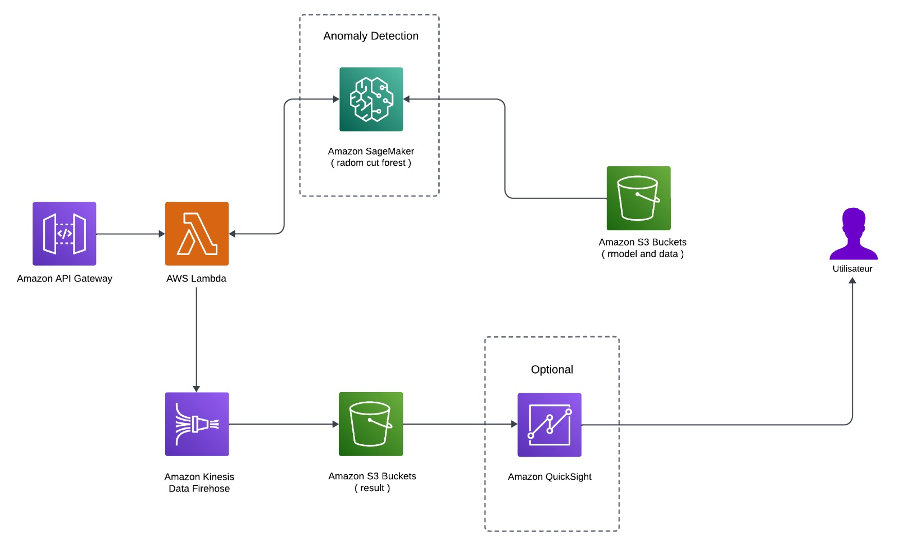

# Fraud and Anomaly Detection in IoT Data Using Machine Learning

## Overview

In the rapidly evolving landscape of Internet of Things (IoT), the integrity and security of data transactions are paramount. With the surge in IoT applications, there's a corresponding increase in fraudulent activities, necessitating advanced and dynamic solutions for anomaly detection. This project harnesses the power of cloud computing, Apache Spark, and machine learning to develop scalable, self-improving models capable of identifying fraudulent activities within vast datasets characteristic of IoT systems.

Leveraging Amazon SageMaker, we demonstrate the training of unsupervised machine learning models on historical IoT data to predict potential fraud. These models, once trained, are deployed via a REST API, seamlessly integrating with existing business infrastructures and providing a robust defense mechanism against fraud in IoT networks, particularly for Zen Networks.

## Project Goals

Initially, we were tasked with utilizing Zen Networks data, containing tens of millions of rows, which necessitates a performant machine and sophisticated technologies like Spark for processing. To showcase the capabilities of this data, we utilized the `local_fraud_detection_1week_zennetwork_data.ipynb` notebook, executed locally to avoid charges on our free AWS accounts. Due to constraints on our machine's capabilities, we opted to utilize only one week of data. Further details regarding evaluation and feature engineering potential are outlined within the notebook.

The subsequent part of the project, conducted on the cloud, involves demonstrating a similar process using public, anonymized credit card transactions. This dataset mirrors the structure of Zen Network data and can be easily adapted for our specific case.

## Project Architecture

This diagram represents the comprehensive architecture of our solution, incorporating Amazon SageMaker for model training and deployment, AWS Lambda for running inference code, and Amazon API Gateway for creating a RESTful service.

## Key Components

- **Machine Learning Models**: Focus on unsupervised learning with Amazon SageMaker, using the RandomCutForest algorithm for anomaly detection in unlabeled datasets.
- **Data Processing**: Utilize Apache Spark for efficient processing of large datasets, enabling the analysis of millions of rows with high performance.
- **Deployment**: Leverage Amazon SageMaker-managed endpoints for model deployment, and Amazon API Gateway alongside AWS Lambda for creating a scalable REST API service.

## Data Overview

### Zen Network Data

- **Scope**: Telecommunications session data over one week, rich in numerical features for temporal and session frequency analysis.
- **Application**: Ideal for anomaly detection and performance analysis in telecommunications.

### Credit Card Transaction Data

- **Characteristics**: Highly unbalanced dataset with anonymized numerical features, focusing on transaction amount and time for fraud detection.
- **Importance**: Serves as a proxy for the kind of data we handle, demonstrating the applicability of our model to real-world financial transactions.

## Project Contents

* `deployment/`
  * `fraud-detection-using-machine-learning.yaml`: Creates AWS CloudFormation Stack for solution
* `local_application/`
  * `local_fraud_detection_1week_zennetwork_data.ipynb`: Local application on Zen Netwrok data
* `source/`
  * `lambda`
    * `model-invocation/`
      * `index.py`: Lambda function script for invoking SageMaker endpoints for inference
  * `notebooks/`
    * `src`
      * `package`
        * `config.py`: Read in the environment variables set during the Amazon CloudFormation stack creation
        * `generate_endpoint_traffic.py`: Custom script to show how to send transaction traffic to REST API for inference
        * `util.py`: Helper function and utilities
    * `aws_fraud_detection_credit_card_data.ipynb`: Orchestrates the solution. Trains the models and deploys the trained model
  * `scripts/`
    * `set_kernelspec.py`: Used to update the kernelspec name at deployment.
  * `test/`
    * `run_notebook.py`: Used to automatically run the notebook
    * `test_deployment_out.ipynb`: File that is used to automatically test the solution

## Getting Started

This section guides you through deploying the solution using AWS CloudFormation. Ensure you have an AWS account and follow the step-by-step instructions to create and configure the necessary AWS resources.

### Deployment Steps

1. **AWS Management Console Login**: Log in and select your preferred region.
2. **AWS CloudFormation Access**: Navigate to AWS CloudFormation in the Services menu.
3. **Create New Stack**: Use "With new resources (standard)" option, uploading the provided YAML template.
4. **Stack Configuration**: Name your stack and fill in required parameters, such as `SolutionPrefix` and `CreateSageMakerNotebookInstance`.
5. **Review and Create**: After configuring stack options and reviewing your settings, acknowledge IAM resource creation and click "Create stack".
6. **Monitor Deployment**: Wait for the "CREATE_COMPLETE" status, then access the "Outputs" tab for resource details.

### Clean Up

Remember to delete the stack to avoid future charges by selecting it in the AWS CloudFormation console and clicking "Delete".

## Conclusion

By leveraging advanced machine learning techniques and AWS cloud services, this project provides a robust solution for detecting fraud and anomalies in IoT data, ensuring the security and reliability of IoT networks.